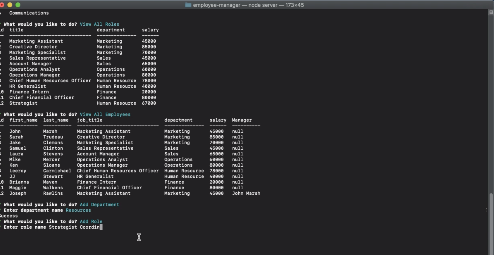

# Employee-Manager
This project uses Node, Inquirer, and MySQL to create a content management system (CMS) that allows the user to view and edit an employee database.

## Walkthrough Video

## Table of Contents
* [Installation](#installation)
* [License](#license)
* [Built With](#built-with)
* [Questions](#questions)
* [Credits](#credits)

## Installation
Install necessary depedencies then run "server js" in the terminal

## License
This application uses the MIT license.

## Built With
* Node
* MySQL
* Inquirer
* Express
* Console.table

## Questions
Feel free to contact regarding any questions you may have. 
Github: https://github.com/wamackie 
Email: wamackie8456@gmail.com

## Credits
Employee Manager was created by William Mackie
